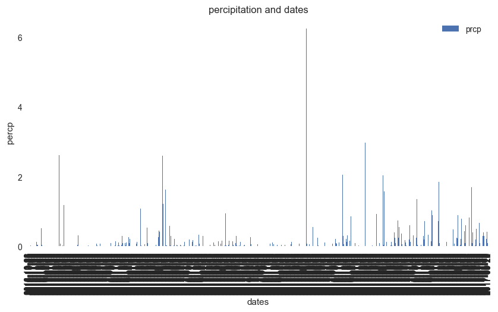
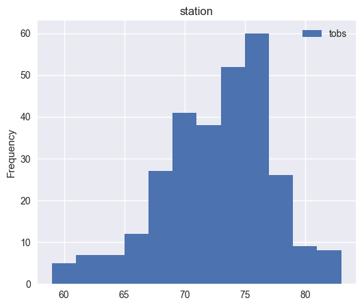
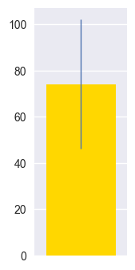

```python
from sqlalchemy import create_engine
from sqlalchemy.ext.declarative import declarative_base
from sqlalchemy import Column, Integer, String, Float 
from sqlalchemy import create_engine
from sqlalchemy.ext.automap import automap_base
from sqlalchemy.orm import Session
import pymysql
pymysql.install_as_MySQLdb()
from sqlalchemy.orm import session
import sqlite3
from datetime import datetime,timedelta
from sqlalchemy import func
import pandas as pd
import seaborn as sb
```


```python
engine = create_engine("sqlite:///hawaii1.sqlite", echo=False)
```


```python
Base = automap_base()
Base.prepare(engine, reflect=True)
Base.classes.keys()
```


    ['Measurement', 'Station']


```python
Measurement=Base.classes.Measurement
Station=Base.classes.Station
```


```python
session = Session(engine)
```


```python
date_object = session.query(func.max(Measurement.date)).scalar()
print(date_object)

last_months=session.query(Measurement.date,Measurement.prcp).filter(Measurement.date>= '2016-08-01').all()
#for result in last_months:
 #   print(result)
```

    2017-08-23
    


```python
from datetime import datetime, timedelta
date_object = datetime.today() #session.query(func.max(Measurement.date)).scalar()
date_object
```


    datetime.datetime(2017, 10, 21, 7, 37, 22, 365715)


```python
from dateutil.relativedelta import relativedelta
datetime_object =date_object#datetime.strptime(date_object, '%Y-%m-%d')
startdate =datetime_object - relativedelta(months=12)
startdate 
```


    datetime.datetime(2016, 10, 21, 7, 37, 22, 365715)


```python
qry =session.query(Measurement.date,Measurement.prcp).filter(Measurement.date.between( startdate,date_object )).all()
qry
```


    [('2016-10-22', 0.15),
     ('2016-10-23', 0.01),
     ('2016-10-24', 0.0),
     ('2016-10-25', 0.03),
     ('2016-10-26', 0.0),
     ('2016-10-27', 0.0),
     ('2016-10-28', 0.0),
     ('2016-10-29', 0.0),
     ('2016-10-30', 0.24),
     ('2016-10-31', 0.03),
     ('2016-11-01', 0.0),
     ('2016-11-02', 0.0),
     ('2016-11-03', 0.0),
     ('2016-11-04', 0.0),
     ('2016-11-05', 0.0),
     ('2016-11-06', 0.0),
     ('2016-11-07', 0.0),
     ('2016-11-08', 0.07),
     ('2016-11-09', 0.0),
     ('2016-11-10', 0.0),
     ('2016-11-11', 0.0),
     ('2016-11-12', 0.0),
     ('2016-11-13', 0.0),
     ('2016-11-14', 0.0),
     ('2016-11-15', 0.0),
     ('2016-11-16', 0.0),
     ('2016-11-17', 0.0),
     ('2016-11-18', 0.0),
     ('2016-11-19', 0.03),
     ('2016-11-20', 0.05),
     ('2016-11-21', 0.01),
     ('2016-11-22', 0.13),
     ('2016-11-23', 0.14),
     ('2016-11-24', 0.05),
     ('2016-11-25', 0.05),
     ('2016-11-26', 0.05),
     ('2016-11-27', 0.0),
     ('2016-11-28', 0.01),
     ('2016-11-29', 0.0),
     ('2016-11-30', 0.14),
     ('2016-12-01', 0.12),
     ('2016-12-02', 0.03),
     ('2016-12-03', 0.0),
     ('2016-12-04', 0.03),
     ('2016-12-05', 0.43),
     ('2016-12-06', 0.02),
     ('2016-12-07', 0.0),
     ('2016-12-08', 0.03),
     ('2016-12-09', 0.52),
     ('2016-12-10', 0.05),
     ('2016-12-11', 0.04),
     ('2016-12-12', 0.01),
     ('2016-12-13', 0.05),
     ('2016-12-14', 0.03),
     ('2016-12-15', 0.0),
     ('2016-12-16', 0.0),
     ('2016-12-17', 0.01),
     ('2016-12-18', 0.13),
     ('2016-12-19', 0.01),
     ('2016-12-20', 0.0),
     ('2016-12-21', 0.0),
     ('2016-12-22', 0.01),
     ('2016-12-23', 0.01),
     ('2016-12-24', 0.01),
     ('2016-12-25', 0.0),
     ('2016-12-26', 0.02),
     ('2016-12-27', 0.0),
     ('2016-12-28', 0.02),
     ('2016-12-29', 0.04),
     ('2016-12-30', 0.12),
     ('2016-12-31', 0.01),
     ('2017-01-01', 0.0),
     ('2017-01-02', 0.0),
     ('2017-01-03', 0.0),
     ('2017-01-04', 0.0),
     ('2017-01-05', 0.0),
     ('2017-01-06', 0.0),
     ('2017-01-07', 0.0),
     ('2017-01-08', 0.0),
     ('2017-01-09', 0.0),
     ('2017-01-10', 0.0),
     ('2017-01-11', 0.0),
     ('2017-01-12', 0.0),
     ('2017-01-13', 0.0),
     ('2017-01-14', 0.0),
     ('2017-01-15', 0.0),
     ('2017-01-16', 0.0),
     ('2017-01-17', 0.0),
     ('2017-01-18', 0.0),
     ('2017-01-19', 0.0),
     ('2017-01-20', 0.0),
     ('2017-01-21', 0.0),
     ('2017-01-22', 0.16),
     ('2017-01-23', 0.0),
     ('2017-01-24', 0.04),
     ('2017-01-25', 0.03),
     ('2017-01-26', 0.0),
     ('2017-01-27', 0.0),
     ('2017-01-28', 0.0),
     ('2017-01-29', 0.18),
     ('2017-01-30', 0.0),
     ('2017-01-31', 0.0),
     ('2017-02-01', 0.0),
     ('2017-02-02', 0.0),
     ('2017-02-03', 0.0),
     ('2017-02-04', 0.0),
     ('2017-02-05', 0.0),
     ('2017-02-06', 0.0),
     ('2017-02-07', 0.51),
     ('2017-02-08', 0.0),
     ('2017-02-09', 0.0),
     ('2017-02-10', 0.0),
     ('2017-02-11', 0.31),
     ('2017-02-12', 2.62),
     ('2017-02-13', 0.01),
     ('2017-02-14', 0.0),
     ('2017-02-15', 0.0),
     ('2017-02-16', 0.07),
     ('2017-02-17', 0.0),
     ('2017-02-18', 0.0),
     ('2017-02-19', 0.0),
     ('2017-02-20', 0.0),
     ('2017-02-21', 0.06),
     ('2017-02-22', 0.06),
     ('2017-02-23', 0.01),
     ('2017-02-24', 0.0),
     ('2017-02-25', 0.03),
     ('2017-02-26', 0.0),
     ('2017-02-27', 0.0),
     ('2017-02-28', 0.0),
     ('2017-03-01', 1.19),
     ('2017-03-02', 0.73),
     ('2017-03-03', 0.47),
     ('2017-03-04', 0.0),
     ('2017-03-05', 0.35),
     ('2017-03-06', 0.0),
     ('2017-03-07', 0.0),
     ('2017-03-08', 0.0),
     ('2017-03-09', 0.0),
     ('2017-03-10', 0.0),
     ('2017-03-11', 0.0),
     ('2017-03-12', 0.0),
     ('2017-03-13', 0.0),
     ('2017-03-14', 0.0),
     ('2017-03-15', 0.0),
     ('2017-03-16', 0.0),
     ('2017-03-17', 0.0),
     ('2017-03-18', 0.0),
     ('2017-03-19', 0.0),
     ('2017-03-20', 0.0),
     ('2017-03-21', 0.0),
     ('2017-03-22', 0.0),
     ('2017-03-23', 0.0),
     ('2017-03-24', 0.02),
     ('2017-03-25', 0.0),
     ('2017-03-26', 0.0),
     ('2017-03-27', 0.0),
     ('2017-03-28', 0.0),
     ('2017-03-29', 0.0),
     ('2017-03-30', 0.0),
     ('2017-03-31', 0.0),
     ('2017-04-01', 0.0),
     ('2017-04-02', 0.0),
     ('2017-04-03', 0.0),
     ('2017-04-04', 0.0),
     ('2017-04-05', 0.0),
     ('2017-04-06', 0.0),
     ('2017-04-07', 0.0),
     ('2017-04-08', 0.0),
     ('2017-04-09', 0.0),
     ('2017-04-10', 0.0),
     ('2017-04-11', 0.0),
     ('2017-04-12', 0.0),
     ('2017-04-13', 0.0),
     ('2017-04-14', 0.26),
     ('2017-04-15', 0.01),
     ('2017-04-16', 0.0),
     ('2017-04-17', 0.02),
     ('2017-04-18', 0.0),
     ('2017-04-19', 0.02),
     ('2017-04-20', 0.05),
     ('2017-04-21', 0.23),
     ('2017-04-22', 0.32),
     ('2017-04-23', 0.03),
     ('2017-04-24', 0.0),
     ('2017-04-25', 0.0),
     ('2017-04-26', 0.0),
     ('2017-04-27', 0.0),
     ('2017-04-28', 0.0),
     ('2017-04-29', 0.12),
     ('2017-04-30', 0.89),
     ('2017-05-01', 0.26),
     ('2017-05-02', 0.0),
     ('2017-05-03', 0.0),
     ('2017-05-04', 0.0),
     ('2017-05-05', 0.0),
     ('2017-05-06', 0.0),
     ('2017-05-07', 0.0),
     ('2017-05-08', 0.0),
     ('2017-05-10', 0.0),
     ('2017-05-11', 0.01),
     ('2017-05-12', 0.0),
     ('2017-05-13', 0.0),
     ('2017-05-14', 0.0),
     ('2017-05-15', 0.05),
     ('2017-05-16', 0.01),
     ('2017-05-17', 0.0),
     ('2017-05-18', 0.01),
     ('2017-05-19', 0.0),
     ('2017-05-20', 0.0),
     ('2017-05-21', 0.0),
     ('2017-05-22', 0.0),
     ('2017-05-23', 0.08),
     ('2017-05-24', 0.13),
     ('2017-05-25', 0.15),
     ('2017-05-27', 0.01),
     ('2017-05-28', 0.02),
     ('2017-05-29', 0.0),
     ('2017-05-30', 0.26),
     ('2017-05-31', 0.02),
     ('2017-06-01', 0.0),
     ('2017-06-02', 0.0),
     ('2017-06-03', 0.02),
     ('2017-06-04', 0.0),
     ('2017-06-05', 0.0),
     ('2017-06-06', 0.0),
     ('2017-06-07', 0.0),
     ('2017-06-08', 0.0),
     ('2017-06-09', 0.0),
     ('2017-06-10', 0.04),
     ('2017-06-11', 0.08),
     ('2017-06-12', 0.02),
     ('2017-06-13', 0.0),
     ('2017-06-14', 0.0),
     ('2017-06-15', 0.0),
     ('2017-06-16', 0.0),
     ('2017-06-17', 0.0),
     ('2017-06-18', 0.05),
     ('2017-06-19', 0.0),
     ('2017-06-20', 0.02),
     ('2017-06-21', 0.0),
     ('2017-06-22', 0.0),
     ('2017-06-23', 0.0),
     ('2017-06-24', 0.06),
     ('2017-06-25', 0.0),
     ('2017-06-26', 0.0),
     ('2017-06-27', 0.0),
     ('2017-06-28', 0.0),
     ('2017-06-29', 0.0),
     ('2017-06-30', 0.08),
     ('2017-07-01', 0.02),
     ('2017-07-02', 0.02),
     ('2017-07-03', 0.04),
     ('2017-07-04', 0.04),
     ('2017-07-05', 0.0),
     ('2017-07-06', 0.0),
     ('2017-07-07', 0.0),
     ('2017-07-08', 0.0),
     ('2017-07-09', 0.0),
     ('2017-07-10', 0.0),
     ('2017-07-11', 0.0),
     ('2017-07-12', 0.0),
     ('2017-07-13', 0.07),
     ('2017-07-14', 0.02),
     ('2017-07-15', 0.0),
     ('2017-07-16', 0.02),
     ('2017-07-17', 0.03),
     ('2017-07-18', 0.05),
     ('2017-07-20', 0.03),
     ('2017-07-21', 0.0),
     ('2017-07-22', 0.03),
     ('2017-07-23', 0.0),
     ('2017-07-24', 0.05),
     ('2017-07-25', 0.0),
     ('2017-07-26', 0.0),
     ('2017-07-27', 0.0),
     ('2017-07-28', 0.0),
     ('2017-07-29', 0.0),
     ('2017-07-30', 0.0),
     ('2017-07-31', 0.0),
     ('2017-08-01', 0.02),
     ('2017-08-02', 0.0),
     ('2017-08-03', 0.0),
     ('2017-08-04', 0.02),
     ('2017-08-05', 0.0),
     ('2017-08-06', 0.0),
     ('2017-08-07', 0.0),
     ('2017-08-08', 0.0),
     ('2017-08-09', 0.0),
     ('2017-08-10', 0.0),
     ('2017-08-11', 0.0),
     ('2017-08-12', 0.0),
     ('2017-08-13', 0.0),
     ('2017-08-14', 0.0),
     ('2017-08-15', 0.02),
     ('2017-08-18', 0.0),
     ('2017-08-19', 0.0),
     ('2017-08-20', 0.0),
     ('2017-08-21', 0.0),
     ('2017-08-22', 0.0),
     ('2017-08-23', 0.0),
     ('2016-10-22', 0.1),
     ('2016-10-23', 0.01),
     ('2016-10-24', 0.0),
     ('2016-10-25', 0.04),
     ('2016-10-26', 0.06),
     ('2016-10-27', 0.11),
     ('2016-10-28', 0.02),
     ('2016-10-29', 0.02),
     ('2016-10-30', 0.1),
     ('2016-10-31', 0.03),
     ('2016-11-01', 0.01),
     ('2016-11-02', 0.0),
     ('2016-11-03', 0.0),
     ('2016-11-04', 0.0),
     ('2016-11-05', 0.02),
     ('2016-11-06', 0.02),
     ('2016-11-07', 0.0),
     ('2016-11-08', 0.14),
     ('2016-11-09', 0.08),
     ('2016-11-10', 0.0),
     ('2016-11-11', 0.0),
     ('2016-11-12', 0.0),
     ('2016-11-13', 0.0),
     ('2016-11-14', 0.06),
     ('2016-11-15', 0.0),
     ('2016-11-16', 0.14),
     ('2016-11-17', 0.03),
     ('2016-11-18', 0.01),
     ('2016-11-19', 0.11),
     ('2016-11-20', 0.11),
     ('2016-11-21', 0.02),
     ('2016-11-22', 0.41),
     ('2016-11-23', 0.03),
     ('2016-11-24', 0.2),
     ('2016-11-25', 0.05),
     ('2016-11-26', 0.05),
     ('2016-11-27', 0.06),
     ('2016-11-28', 0.02),
     ('2016-11-29', 0.04),
     ('2016-11-30', 0.05),
     ('2016-12-01', 0.33),
     ('2016-12-02', 0.3),
     ('2016-12-03', 0.04),
     ('2016-12-04', 0.1),
     ('2016-12-05', 0.34),
     ('2016-12-06', 0.02),
     ('2016-12-07', 0.17),
     ('2016-12-08', 0.03),
     ('2016-12-09', 0.34),
     ('2016-12-10', 0.02),
     ('2016-12-11', 0.02),
     ('2016-12-12', 0.01),
     ('2016-12-13', 0.1),
     ('2016-12-14', 0.05),
     ('2016-12-15', 0.02),
     ('2016-12-16', 0.01),
     ('2016-12-17', 0.11),
     ('2016-12-18', 0.29),
     ('2016-12-19', 0.21),
     ('2016-12-20', 0.02),
     ('2016-12-21', 0.03),
     ('2016-12-22', 0.17),
     ('2016-12-23', 0.1),
     ('2016-12-24', 0.14),
     ('2016-12-25', 0.03),
     ('2016-12-26', 0.26),
     ('2016-12-27', 0.03),
     ('2016-12-28', 0.09),
     ('2016-12-29', 0.18),
     ('2016-12-30', 0.21),
     ('2016-12-31', 0.62),
     ('2017-01-01', 0.29),
     ('2017-01-02', 0.0),
     ('2017-01-03', 0.0),
     ('2017-01-04', 0.0),
     ('2017-01-05', 0.0),
     ('2017-01-06', 0.0),
     ('2017-01-07', 0.06),
     ('2017-01-08', 0.0),
     ('2017-01-09', 0.0),
     ('2017-01-10', 0.0),
     ('2017-01-11', 0.0),
     ('2017-01-12', 0.0),
     ('2017-01-13', 0.0),
     ('2017-01-14', 0.0),
     ('2017-01-15', 0.0),
     ('2017-01-16', 0.0),
     ('2017-01-17', 0.0),
     ('2017-01-18', 0.0),
     ('2017-01-19', 0.0),
     ('2017-01-20', 0.0),
     ('2017-01-21', 0.04),
     ('2017-01-22', 0.01),
     ('2017-01-23', 0.08),
     ('2017-01-24', 0.15),
     ('2017-01-25', 0.12),
     ('2017-01-26', 0.0),
     ('2017-01-27', 0.0),
     ('2017-01-28', 0.14),
     ('2017-01-29', 0.0),
     ('2017-01-30', 0.0),
     ('2017-01-31', 0.0),
     ('2017-02-01', 0.0),
     ('2017-02-02', 0.0),
     ('2017-02-03', 0.0),
     ('2017-02-04', 0.0),
     ('2017-02-05', 0.0),
     ('2017-02-06', 0.16),
     ('2017-02-07', 1.08),
     ('2017-02-08', 1.08),
     ('2017-02-09', 0.02),
     ('2017-02-10', 0.0),
     ('2017-02-11', 1.0),
     ('2017-02-12', 1.07),
     ('2017-02-13', 2.9),
     ('2017-02-14', 0.0),
     ('2017-02-15', 0.0),
     ('2017-02-16', 0.0),
     ('2017-02-17', 0.8),
     ('2017-02-18', 0.0),
     ('2017-02-19', 0.0),
     ('2017-02-20', 0.0),
     ('2017-02-21', 0.0),
     ('2017-02-22', 0.06),
     ('2017-02-23', 0.0),
     ('2017-02-24', 0.0),
     ('2017-02-25', 0.0),
     ('2017-02-26', 0.0),
     ('2017-02-27', 0.0),
     ('2017-02-28', 0.16),
     ('2017-03-01', 2.2),
     ('2017-03-02', 1.45),
     ('2017-03-03', 0.54),
     ('2017-03-04', 0.0),
     ('2017-03-05', 0.1),
     ('2017-03-06', 0.51),
     ('2017-03-07', 0.0),
     ('2017-03-08', 0.0),
     ('2017-03-09', 0.8),
     ('2017-03-10', 0.13),
     ('2017-03-11', 0.03),
     ('2017-03-12', 0.0),
     ('2017-03-13', 0.0),
     ('2017-03-14', 0.0),
     ('2017-03-15', 0.0),
     ('2017-03-16', 0.0),
     ('2017-03-17', 0.19),
     ('2017-03-18', 0.0),
     ('2017-03-19', 0.0),
     ('2017-03-20', 0.0),
     ('2017-03-21', 0.0),
     ('2017-03-22', 0.0),
     ('2017-03-23', 0.0),
     ('2017-03-24', 0.6),
     ('2017-03-25', 0.13),
     ('2017-03-26', 0.0),
     ('2017-03-27', 0.0),
     ('2017-03-28', 0.03),
     ('2017-03-29', 0.0),
     ('2017-03-30', 0.08),
     ('2017-03-31', 0.0),
     ('2017-04-01', 0.0),
     ('2017-04-02', 0.0),
     ('2017-04-03', 0.08),
     ('2017-04-04', 0.04),
     ('2017-04-05', 0.04),
     ('2017-04-06', 0.0),
     ('2017-04-07', 0.0),
     ('2017-04-08', 0.0),
     ('2017-04-09', 0.0),
     ('2017-04-10', 0.01),
     ('2017-04-11', 0.03),
     ('2017-04-12', 0.03),
     ('2017-04-13', 0.27),
     ('2017-04-14', 0.69),
     ('2017-04-15', 0.45),
     ('2017-04-16', 0.49),
     ('2017-04-17', 0.41),
     ('2017-04-18', 0.08),
     ('2017-04-19', 0.02),
     ('2017-04-20', 0.33),
     ('2017-04-21', 1.16),
     ('2017-04-22', 1.01),
     ('2017-04-23', 0.02),
     ('2017-04-24', 0.0),
     ('2017-04-25', 0.0),
     ('2017-04-26', 0.0),
     ('2017-04-27', 0.1),
     ('2017-04-28', 2.6),
     ('2017-04-29', 0.35),
     ('2017-04-30', 1.21),
     ('2017-05-01', 0.07),
     ('2017-05-02', 0.03),
     ('2017-05-03', 0.01),
     ('2017-05-04', 0.0),
     ('2017-05-05', 0.0),
     ('2017-05-06', 0.0),
     ('2017-05-07', 0.07),
     ('2017-05-08', 0.22),
     ('2017-05-09', 1.62),
     ('2017-05-10', 0.05),
     ('2017-05-11', 0.03),
     ('2017-05-12', 0.04),
     ('2017-05-13', 0.02),
     ('2017-05-14', 0.05),
     ('2017-05-15', 0.08),
     ('2017-05-16', 0.03),
     ('2017-05-17', 0.02),
     ('2017-05-18', 0.09),
     ('2017-05-19', 0.02),
     ('2017-05-20', 0.0),
     ('2017-05-21', 0.0),
     ('2017-05-22', 0.0),
     ('2017-05-23', 0.02),
     ('2017-05-24', 0.58),
     ('2017-05-25', 0.37),
     ('2017-05-26', 0.02),
     ('2017-05-27', 0.0),
     ('2017-05-28', 0.29),
     ('2017-05-29', 0.02),
     ('2017-05-30', 0.2),
     ('2017-05-31', 0.1),
     ('2017-06-01', 0.03),
     ('2017-06-02', 0.1),
     ('2017-06-03', 0.2),
     ('2017-06-04', 0.15),
     ('2017-06-05', 0.0),
     ('2017-06-06', 0.0),
     ('2017-06-07', 0.0),
     ('2017-06-08', 0.02),
     ('2017-06-09', 0.02),
     ('2017-06-10', 0.21),
     ('2017-06-11', 0.24),
     ('2017-06-12', 0.19),
     ('2017-06-13', 0.36),
     ('2017-06-14', 0.27),
     ('2017-06-15', 0.17),
     ('2017-06-16', 0.02),
     ('2017-06-17', 0.35),
     ('2017-06-18', 0.25),
     ('2017-06-19', 0.05),
     ('2017-06-20', 0.05),
     ('2017-06-21', 0.02),
     ('2017-06-22', 0.1),
     ('2017-06-23', 0.0),
     ('2017-06-24', 0.0),
     ('2017-06-25', 0.08),
     ('2017-06-26', 0.02),
     ('2017-06-27', 0.0),
     ('2017-06-28', 0.01),
     ('2017-06-29', 0.03),
     ('2017-06-30', 0.04),
     ('2017-07-01', 0.06),
     ('2017-07-02', 0.05),
     ('2017-07-03', 0.13),
     ('2017-07-04', 0.03),
     ('2017-07-05', 0.0),
     ('2017-07-06', 0.0),
     ('2017-07-07', 0.02),
     ('2017-07-08', 0.02),
     ('2017-07-09', 0.09),
     ('2017-07-10', 0.0),
     ('2017-07-11', 0.01),
     ('2017-07-12', 0.01),
     ('2017-07-13', 0.33),
     ('2017-07-14', 0.05),
     ('2017-07-15', 0.03),
     ('2017-07-16', 0.07),
     ('2017-07-17', 0.12),
     ('2017-07-18', 0.03),
     ('2017-07-19', 0.0),
     ('2017-07-20', 0.12),
     ('2017-07-21', 0.0),
     ('2017-07-22', 0.07),
     ('2017-07-23', 0.06),
     ('2017-07-24', 0.58),
     ('2017-07-25', 0.03),
     ('2017-07-26', 0.06),
     ('2017-07-27', 0.0),
     ('2017-07-28', 0.13),
     ('2017-07-29', 0.06),
     ('2017-07-30', 0.0),
     ('2017-07-31', 0.0),
     ('2016-10-24', 0.01),
     ('2016-10-25', 0.0),
     ('2016-10-27', 0.2),
     ('2016-10-28', 0.07),
     ('2016-10-29', 0.26),
     ('2016-10-30', 0.14),
     ('2016-10-31', 0.0),
     ('2016-11-01', 0.0),
     ('2016-11-02', 0.0),
     ('2016-11-03', 0.0),
     ('2016-11-04', 0.0),
     ('2016-11-05', 0.0),
     ('2016-11-06', 0.0),
     ('2016-11-07', 0.13),
     ('2016-11-08', 0.02),
     ('2016-11-09', 0.17),
     ('2016-11-10', 0.0),
     ('2016-11-11', 0.0),
     ('2016-11-12', 0.0),
     ('2016-11-13', 0.0),
     ('2016-11-14', 0.05),
     ('2016-11-15', 0.0),
     ('2016-11-16', 0.18),
     ('2016-11-17', 0.0),
     ('2016-11-26', 0.02),
     ('2016-11-27', 0.03),
     ('2016-11-28', 0.0),
     ('2016-11-29', 0.04),
     ('2016-11-30', 0.03),
     ('2016-12-01', 0.07),
     ('2016-12-02', 0.4),
     ('2016-12-03', 0.26),
     ('2016-12-04', 0.0),
     ('2016-12-05', 0.2),
     ('2016-12-08', 0.02),
     ('2016-12-09', 0.26),
     ('2016-12-10', 0.0),
     ('2016-12-13', 0.34),
     ('2016-12-14', 0.12),
     ('2016-12-15', 0.07),
     ('2016-12-16', 0.0),
     ('2016-12-17', 0.0),
     ('2016-12-18', 0.04),
     ('2016-12-19', 0.0),
     ('2016-12-20', 0.0),
     ('2016-12-21', 0.09),
     ('2016-12-22', 0.05),
     ('2016-12-23', 0.03),
     ('2016-12-24', 0.13),
     ('2016-12-27', 0.02),
     ('2016-12-28', 0.01),
     ('2016-12-29', 0.56),
     ('2016-12-30', 0.29),
     ('2016-12-31', 0.36),
     ('2017-01-01', 0.0),
     ('2017-01-02', 0.01),
     ('2017-01-03', 0.0),
     ('2017-01-04', 0.0),
     ('2017-01-05', 0.0),
     ('2017-01-06', 0.59),
     ('2017-01-07', 0.0),
     ('2017-01-08', 0.03),
     ('2017-01-09', 0.0),
     ('2017-01-10', 0.0),
     ('2017-01-11', 0.0),
     ('2017-01-14', 0.0),
     ('2017-01-17', 0.0),
     ('2017-01-18', 0.0),
     ('2017-01-19', 0.0),
     ('2017-01-20', 0.0),
     ('2017-01-21', 0.02),
     ('2017-01-26', 0.01),
     ('2017-01-27', 0.0),
     ('2017-01-28', 0.0),
     ('2017-01-31', 0.0),
     ('2017-02-01', 0.0),
     ('2017-02-02', 0.0),
     ('2017-02-03', 0.0),
     ('2017-02-06', 0.04),
     ('2017-02-07', 0.9),
     ('2017-02-08', 0.0),
     ('2017-02-09', 0.0),
     ('2017-02-10', 0.0),
     ('2017-02-11', 2.39),
     ('2017-02-12', 1.91),
     ('2017-02-13', 0.0),
     ('2017-02-14', 0.0),
     ('2017-02-15', 0.0),
     ('2017-02-16', 0.62),
     ('2017-02-17', 0.06),
     ('2017-02-21', 0.0),
     ('2017-02-22', 0.11),
     ('2017-02-23', 0.0),
     ('2017-02-24', 0.0),
     ('2017-02-27', 0.0),
     ('2017-02-28', 0.04),
     ('2017-03-01', 1.12),
     ('2017-03-07', 0.0),
     ('2017-03-08', 0.0),
     ('2017-03-09', 0.5),
     ('2017-03-10', 0.13),
     ('2017-03-13', 0.0),
     ('2017-03-14', 0.0),
     ('2017-03-17', 0.06),
     ('2017-03-18', 0.0),
     ('2017-03-21', 0.0),
     ('2017-03-22', 0.0),
     ('2017-03-23', 0.0),
     ('2017-03-24', 0.15),
     ('2017-03-28', 0.0),
     ('2017-03-29', 0.03),
     ('2017-03-30', 0.03),
     ('2017-03-31', 0.0),
     ('2017-04-01', 0.0),
     ('2017-04-02', 0.0),
     ('2017-04-03', 0.09),
     ('2017-04-04', 0.0),
     ('2017-04-05', 0.07),
     ('2017-04-06', 0.0),
     ('2017-04-07', 0.0),
     ('2017-04-10', 0.0),
     ('2017-04-11', 0.16),
     ('2017-04-12', 0.29),
     ('2017-04-13', 0.0),
     ('2017-04-14', 0.29),
     ('2017-04-18', 0.12),
     ('2017-04-19', 0.0),
     ('2017-04-20', 0.0),
     ('2017-04-21', 1.05),
     ('2017-04-22', 0.7),
     ('2017-04-25', 0.0),
     ('2017-04-26', 0.14),
     ('2017-04-27', 0.02),
     ('2017-04-28', 0.09),
     ('2017-04-29', 0.95),
     ('2017-04-30', 1.17),
     ('2017-05-01', 0.03),
     ('2017-05-02', 0.01),
     ('2017-05-03', 0.01),
     ('2017-05-04', 0.08),
     ('2017-05-05', 0.28),
     ('2017-05-06', 0.06),
     ('2017-05-08', 0.95),
     ('2017-05-09', 0.52),
     ('2017-05-10', 0.0),
     ('2017-05-16', 0.05),
     ('2017-05-17', 0.0),
     ('2017-05-18', 0.16),
     ('2017-05-19', 0.01),
     ('2017-05-20', 0.01),
     ('2017-05-23', 0.11),
     ('2017-05-24', 0.1),
     ('2017-05-25', 0.07),
     ('2017-05-26', 0.0),
     ('2017-05-27', 0.0),
     ('2017-05-28', 0.02),
     ('2017-05-29', 0.0),
     ('2017-05-30', 0.04),
     ('2017-05-31', 0.0),
     ('2017-06-01', 0.0),
     ('2017-06-02', 0.15),
     ('2017-06-03', 0.16),
     ('2017-06-04', 0.05),
     ('2017-06-05', 0.02),
     ('2017-06-06', 0.0),
     ('2017-06-07', 0.0),
     ('2017-06-08', 0.01),
     ('2017-06-09', 0.0),
     ('2017-06-10', 0.53),
     ('2017-06-11', 0.14),
     ('2017-06-12', 0.35),
     ('2017-06-13', 0.1),
     ('2017-06-14', 0.21),
     ('2017-06-15', 0.3),
     ('2017-06-16', 0.02),
     ('2017-06-17', 0.02),
     ('2017-06-18', 0.18),
     ('2017-06-19', 0.19),
     ('2017-06-20', 0.17),
     ('2017-06-30', 0.0),
     ('2017-07-08', 0.06),
     ('2017-07-09', 0.0),
     ('2017-07-10', 0.0),
     ('2017-07-11', 0.0),
     ('2017-07-12', 0.02),
     ('2017-07-13', 0.3),
     ('2017-07-14', 0.0),
     ('2017-07-15', 0.01),
     ('2017-07-16', 0.12),
     ('2017-07-17', 0.16),
     ('2017-07-18', 0.0),
     ('2017-07-19', 0.09),
     ('2017-07-20', 0.0),
     ('2017-07-21', 0.0),
     ('2017-07-22', 0.12),
     ('2017-07-23', 0.07),
     ('2017-07-24', 1.19),
     ('2017-07-25', 0.12),
     ('2017-07-26', 0.02),
     ('2017-07-27', 0.0),
     ('2017-07-28', 0.14),
     ('2017-07-29', 0.02),
     ('2017-08-01', 0.12),
     ('2017-08-02', 0.05),
     ('2017-08-03', 0.01),
     ('2017-08-04', 0.04),
     ('2017-08-06', 0.0),
     ('2017-08-07', 0.0),
     ('2017-08-08', 0.1),
     ('2017-08-09', 0.0),
     ('2017-08-10', 0.0),
     ('2017-08-11', 0.0),
     ('2017-08-14', 0.01),
     ('2017-08-15', 0.0),
     ('2017-08-16', 0.0),
     ('2017-08-17', 0.0),
     ('2017-08-18', 0.0),
     ('2017-08-19', 0.0),
     ('2017-08-20', 0.01),
     ('2017-08-21', 0.02),
     ('2017-08-23', 0.0),
     ('2016-10-25', 0.4),
     ('2016-10-26', 0.2),
     ('2016-11-09', 0.0),
     ('2016-11-14', 0.02),
     ('2016-12-08', 0.27),
     ('2016-12-12', 0.02),
     ('2016-12-21', 0.06),
     ('2017-01-17', 0.0),
     ('2017-01-18', 0.0),
     ('2017-01-26', 0.0),
     ('2017-01-27', 0.0),
     ('2017-01-30', 0.05),
     ('2017-01-31', 0.0),
     ('2017-02-01', 0.0),
     ('2017-02-02', 0.0),
     ('2017-02-03', 0.0),
     ('2017-02-07', 0.0),
     ('2017-02-08', 0.0),
     ('2017-02-09', 0.0),
     ('2017-02-10', 0.0),
     ('2017-02-14', 0.0),
     ('2017-02-17', 0.0),
     ('2017-02-22', 0.17),
     ('2017-02-23', 0.0),
     ('2017-02-24', 0.0),
     ('2017-03-01', 2.4),
     ('2017-03-02', 0.44),
     ('2017-03-03', 0.14),
     ('2017-03-09', 0.0),
     ('2017-03-10', 0.0),
     ('2017-03-14', 0.06),
     ('2017-03-15', 0.0),
     ('2017-03-31', 0.0),
     ('2017-04-04', 0.0),
     ('2017-04-05', 0.0),
     ('2017-04-06', 0.0),
     ('2017-04-07', 0.0),
     ('2017-04-18', 0.0),
     ('2017-06-22', 0.0),
     ('2017-06-23', 0.0),
     ('2017-06-27', 0.0),
     ('2017-06-28', 0.0),
     ('2017-06-29', 0.0),
     ('2017-06-30', 0.12),
     ('2017-07-18', 0.0),
     ('2017-07-19', 0.0),
     ('2017-07-20', 0.0),
     ('2017-07-21', 0.0),
     ('2017-07-25', 0.0),
     ('2017-07-28', 0.01),
     ('2016-10-22', 0.0),
     ('2016-10-23', 0.0),
     ('2016-10-24', 0.0),
     ('2016-10-25', 0.12),
     ('2016-10-26', 0.02),
     ('2016-10-27', 0.08),
     ('2016-10-28', 0.06),
     ('2016-10-29', 0.01),
     ('2016-10-30', 0.0),
     ('2016-10-31', 0.13),
     ('2016-11-01', 0.01),
     ('2016-11-02', 0.0),
     ('2016-11-03', 0.0),
     ('2016-11-04', 0.0),
     ('2016-11-05', 0.02),
     ('2016-11-06', 0.0),
     ('2016-11-07', 0.0),
     ('2016-11-08', 0.15),
     ('2016-11-09', 0.0),
     ('2016-11-10', 0.0),
     ('2016-11-11', 0.0),
     ('2016-11-12', 0.0),
     ('2016-11-13', 0.0),
     ('2016-11-14', 0.0),
     ('2016-11-15', 0.0),
     ('2016-11-16', 0.07),
     ('2016-11-17', 0.0),
     ('2016-11-18', 0.02),
     ('2016-11-19', 0.13),
     ('2016-11-20', 0.4),
     ('2016-11-21', 0.07),
     ('2016-11-22', 0.31),
     ('2016-11-23', 0.03),
     ('2016-11-24', 0.21),
     ('2016-11-25', 0.11),
     ('2016-11-26', 0.03),
     ('2016-11-27', 0.0),
     ('2016-11-28', 0.0),
     ('2016-11-29', 0.06),
     ('2016-11-30', 0.0),
     ('2016-12-01', 0.16),
     ('2016-12-02', 0.01),
     ('2016-12-03', 0.02),
     ('2016-12-04', 0.32),
     ('2016-12-05', 0.45),
     ('2016-12-06', 0.0),
     ('2016-12-07', 0.07),
     ('2016-12-08', 0.01),
     ('2016-12-11', 0.06),
     ('2016-12-12', 0.0),
     ('2016-12-13', 0.15),
     ('2016-12-14', 0.05),
     ('2016-12-15', 0.0),
     ('2016-12-16', 0.0),
     ('2016-12-17', 0.16),
     ('2016-12-18', 0.27),
     ('2016-12-19', 0.02),
     ('2016-12-20', 0.01),
     ('2016-12-21', 0.06),
     ('2016-12-22', 0.14),
     ('2016-12-23', 0.02),
     ('2016-12-24', 0.06),
     ('2016-12-25', 0.0),
     ('2016-12-26', 0.06),
     ('2016-12-27', 0.0),
     ('2016-12-28', 0.06),
     ('2016-12-29', 0.05),
     ('2016-12-30', 0.07),
     ('2017-01-04', 0.18),
     ('2017-01-05', 0.42),
     ('2017-01-06', 0.01),
     ('2017-01-07', 0.0),
     ('2017-01-08', 0.0),
     ('2017-01-09', 0.0),
     ('2017-01-10', 0.0),
     ('2017-01-16', 0.0),
     ('2017-01-19', 0.0),
     ('2017-01-20', 0.0),
     ('2017-01-21', 0.11),
     ('2017-01-22', 0.04),
     ('2017-01-23', 0.0),
     ('2017-01-24', 0.08),
     ('2017-01-25', 0.0),
     ('2017-01-26', 0.0),
     ('2017-01-27', 0.0),
     ('2017-01-30', 0.0),
     ('2017-01-31', 0.0),
     ('2017-02-01', 0.0),
     ('2017-02-02', 0.0),
     ('2017-02-03', 0.0),
     ('2017-02-04', 0.0),
     ('2017-02-05', 0.0),
     ('2017-02-06', 0.0),
     ('2017-02-07', 1.8),
     ('2017-02-08', 0.0),
     ('2017-02-09', 0.0),
     ('2017-02-10', 0.0),
     ('2017-02-11', 5.04),
     ('2017-02-12', 0.07),
     ('2017-02-13', 0.0),
     ('2017-02-16', 0.67),
     ('2017-02-17', 0.06),
     ('2017-02-18', 0.01),
     ('2017-02-22', 0.13),
     ('2017-02-23', 0.0),
     ('2017-02-24', 0.0),
     ('2017-02-27', 0.0),
     ('2017-02-28', 0.0),
     ('2017-03-01', 0.59),
     ('2017-03-02', 1.48),
     ('2017-03-03', 0.25),
     ('2017-03-04', 0.0),
     ('2017-03-10', 0.0),
     ('2017-03-11', 0.0),
     ('2017-03-12', 0.0),
     ('2017-03-13', 0.0),
     ('2017-03-14', 0.0),
     ('2017-03-15', 0.0),
     ('2017-03-16', 0.0),
     ('2017-03-17', 0.35),
     ('2017-03-18', 0.0),
     ('2017-03-19', 0.0),
     ('2017-03-20', 0.0),
     ('2017-03-21', 0.0),
     ('2017-03-22', 0.0),
     ('2017-03-23', 0.02),
     ('2017-03-24', 0.07),
     ('2017-03-25', 0.43),
     ('2017-03-26', 0.0),
     ('2017-03-27', 0.0),
     ('2017-03-28', 0.0),
     ('2017-03-29', 0.08),
     ('2017-03-30', 0.0),
     ('2017-03-31', 0.0),
     ('2017-04-01', 0.0),
     ('2017-04-02', 0.0),
     ('2017-04-03', 0.0),
     ('2017-04-04', 0.0),
     ('2017-04-05', 0.0),
     ('2017-04-06', 0.0),
     ('2017-04-07', 0.0),
     ('2017-04-10', 0.0),
     ('2017-04-11', 0.0),
     ('2017-04-12', 0.0),
     ('2017-04-13', 0.0),
     ...]


```python
df = pd.DataFrame(qry)
df.set_index("date",inplace=True)
```


```python
len(df)
```


    1675


## Precipitation Analysis


```python
import matplotlib.pyplot as plt; plt.rcdefaults()
import matplotlib.dates as dates
import numpy as np
import matplotlib.pyplot as plt
from matplotlib.dates import DAILY
sb.set(style = 'darkgrid')
my_chart = df.plot(kind="bar",figsize=(10,5),title="percipitation and dates",grid=True)
my_chart.set_xlabel("dates")
my_chart.set_ylabel("percp")
plt.grid(True)
#dates = np.unique(df.index.values)
#xy = [datetime.strptime(dates[x],'%Y-%m-%d') for x in np.arange(0,len(dates),20)]
#t = np.array(xy)
#loc = plt.xaxis.get_major_locator()
#plt.xticks(xy)
#plt.xlim(dates[0],dates[len(dates)-1])
#x = [ datetime.datetime('2017-01-05'),datetime.datetime('2016-10-05')]
#plt.xaxis.set_major_locator(matplotlib.dates.WeekdayLocator(byweekday=matplotlib.dates.MO))
plt.yticks(np.arange(0,df["prcp"].max(),2))
plt.show()
#xticks = ['2016-08-01','2016-12-01','2017-3-01']
# my_chart.xaxis.set_major_locator(dates.MonthLocator())
# my_chart.xaxis.set_major_formatter(dates.DateFormatter('\n\n\n%b\n%Y'))
#xticks=[range(len(df.index)),df.index]                

# y_pos = np.arange(len(qry))
# avgs = [x[1] for x in qry]
# xticks = [x[0] for x in qry]
 
# plt.bar(y_pos, avgs, align='center', alpha=0.5)
# plt.xticks(y_pos, xticks)
# plt.ylabel('Mass (g)')
# plt.title('Average Mammal Mass per Continent')
# plt.show()
```





```python
df.describe()
```


<div>
<style>
    .dataframe thead tr:only-child th {
        text-align: right;
    }

    .dataframe thead th {
        text-align: left;
    }

    .dataframe tbody tr th {
        vertical-align: top;
    }
</style>
<table border="1" class="dataframe">
  <thead>
    <tr style="text-align: right;">
      <th></th>
      <th>prcp</th>
    </tr>
  </thead>
  <tbody>
    <tr>
      <th>count</th>
      <td>1675.000000</td>
    </tr>
    <tr>
      <th>mean</th>
      <td>0.165254</td>
    </tr>
    <tr>
      <th>std</th>
      <td>0.428957</td>
    </tr>
    <tr>
      <th>min</th>
      <td>0.000000</td>
    </tr>
    <tr>
      <th>25%</th>
      <td>0.000000</td>
    </tr>
    <tr>
      <th>50%</th>
      <td>0.010000</td>
    </tr>
    <tr>
      <th>75%</th>
      <td>0.120000</td>
    </tr>
    <tr>
      <th>max</th>
      <td>6.250000</td>
    </tr>
  </tbody>
</table>
</div>


## Station Analysis


```python
total_stations=session.query(func.count(Station.name)).scalar()
total_stations

```


    9


```python
stations=session.query(Measurement.station,func.count(Measurement.tobs)).\
                group_by(Measurement.station).\
                order_by(func.count(Measurement.tobs).desc()).all()
#print(stations)
stationWithHighTobs = stations[0][0]
stationWithHighTobs
```


    'USC00519281'


```python
tobs_per_lastmonths =session.query(Measurement.date,Measurement.tobs).filter(Measurement.date.between( startdate,date_object )).all()
```


```python
tobs_per_lastmonths =session.query(func.max(Measurement.tobs)).first()                                                                             
```


```python
tobs_per_lastmonths_x =session.query(Measurement.tobs).\
                            filter(Measurement.date.between( startdate,date_object )).\
                            filter(Measurement.station == stationWithHighTobs).\
                            all()
#tobs_per_lastmonths_x
```


```python
sb.set(style = 'darkgrid')
x=pd.DataFrame(tobs_per_lastmonths_x,columns=["tobs"])
station_chart = x.plot(kind="hist",figsize=(6,5),bins=12, title="station",grid=True)
plt.show()
```





## Temperature Analysis


```python
def calc_temps(start,end):
    start = datetime.strptime(start,'%Y-%m-%d')
    end = datetime.strptime(end,'%Y-%m-%d')
    results3=session.query(func.max(Measurement.tobs),func.min(Measurement.tobs),func.avg(Measurement.tobs)).\
                     filter(Measurement.date>=start).\
                     filter(Measurement.date<=end).\
                     all()
    temp_dict={}
    temp_dict["max"]=results3[0][0]
    temp_dict["min"]=results3[0][1]
    temp_dict["avg"]=results3[0][2]
    return temp_dict

```


```python
tripStartDate = "2017-06-01"
tripEndDate = "2017-06-12"
data = calc_temps("2016-01-01","2017-01-01")
data
```


    {'avg': 74.0889748549323, 'max': 84, 'min': 56}


```python
# example data
avg = data["avg"]
diff = data["max"]-data["min"]
plt.figure(figsize=(1.5,4))
plt.bar(left=0,height=avg,color='gold',width=1.5)
plt.xlim(-1,1)
plt.errorbar(0, data["avg"],xerr=None, yerr=diff,elinewidth=1)
plt.grid(axis='x')
plt.tick_params(
    axis='x',          # changes apply to the x-axis
    which='both',      # both major and minor ticks are affected
    bottom='off',      # ticks along the bottom edge are off
    top='off',         # ticks along the top edge are off
    labelbottom='off') # labels along the bottom edge are off
plt.show()

```





```python

```
